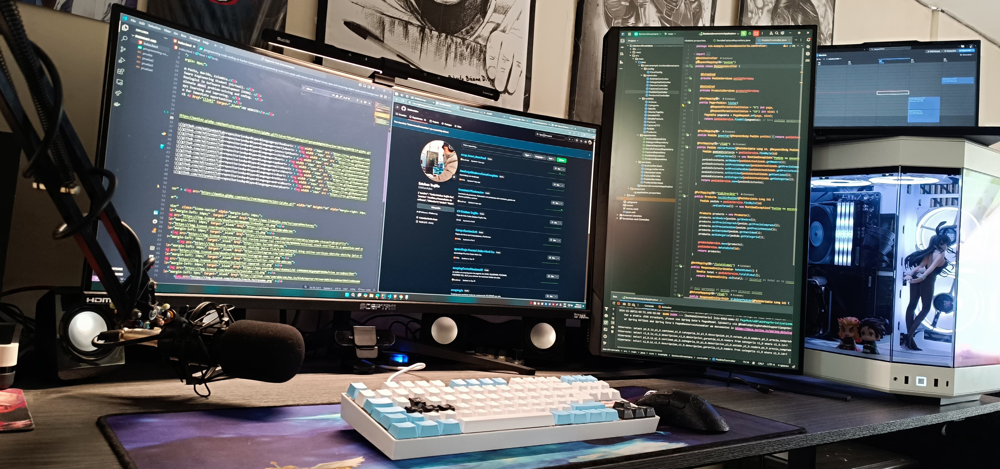

<!DOCTYPE html>
<html lang="en">
<head>
    <meta charset="UTF-8">
    <meta name="viewport" content="width=device-width, initial-scale=1.0">
</head>
<body style="margin: 0px;">
    

<h1 align="center"><b>Hi , I'm Esteban Trujillo </b></h1>

    </a>

  

<picture></picture> <h2 style="display: inline;">About me</h2>

<picture> </picture>

<ul>
    <li>🎓 Software Engineering Student (Virtual). </li> 
    <li>📜 Technologist in Software Development (SENA). </li> 
    <li>💡 Passionate about problem-solving and coding.  </li>
    <li>🚀 Always learning and improving.  </li>
</ul>

<h2><b> Skills</b></h2>

     </a>
     </a>
     </a>
     </a>
     </a>
     </a>
     </a>
     </a>
     </a>
     </a>
     </a>
     </a>
     </a>
     </a>

 
 
<h2 align="center" > Connect with me </h2>

    
    
    

Credits:

<ul>
    <li><a href="https://github.com/Aditya664">Aditya Deshmukh</a></li>
    <li><a href="https://github.com/100rabhcsmc">Saurabh Chavan</a></li>
</ul>
</body>
</html>

